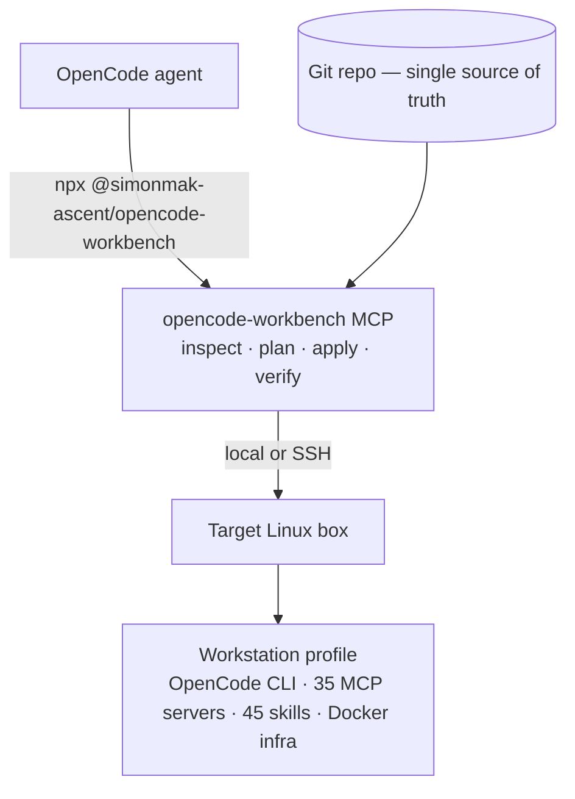
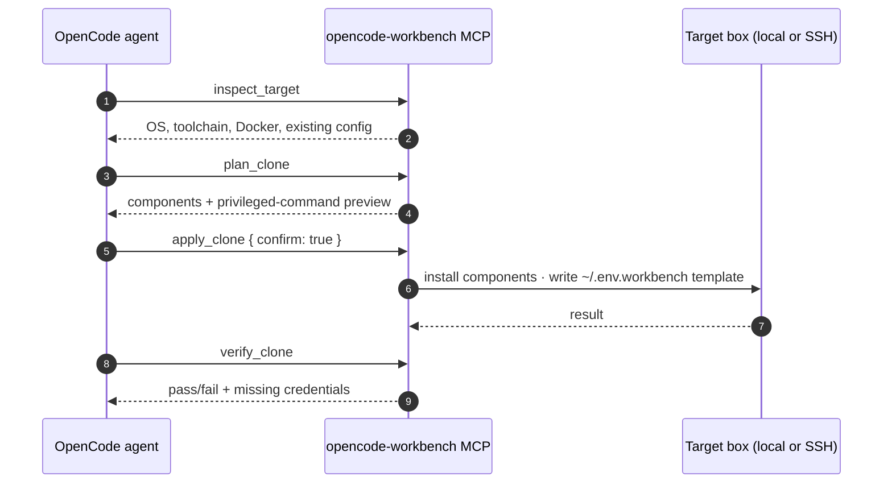
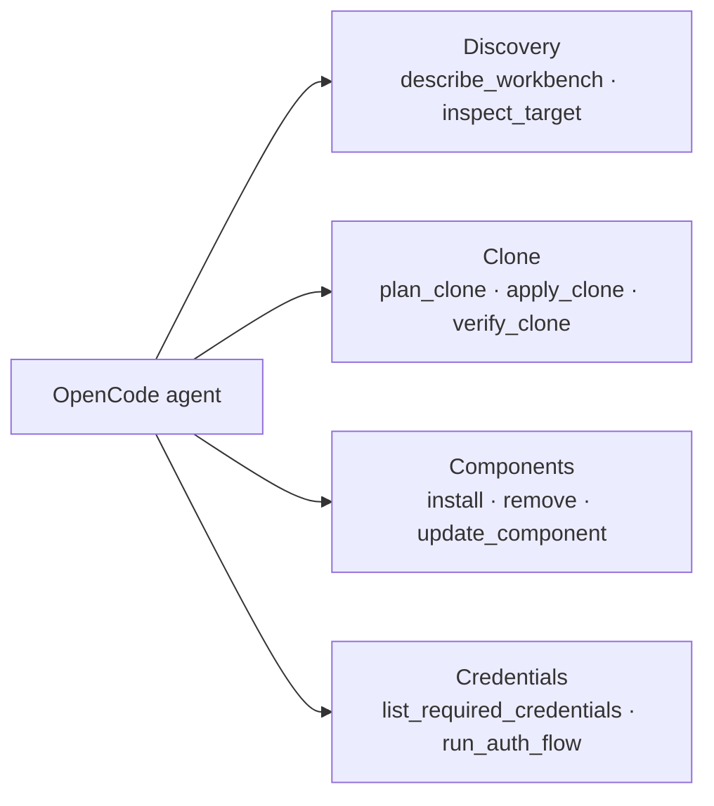

# OpenCode Workbench

<!-- mcp-name: io.github.simonmak-ascent/opencode-workbench -->

> **A reproducible, self-documenting, and recoverable OpenCode development workstation** — configuration, agent skills, MCP stack, and an MCP server that clones the entire setup onto any Linux machine (locally or over SSH).

[](https://github.com/simonmak-ascent/opencode-workbench/actions/workflows/secret-scan.yml)
[](https://github.com/simonmak-ascent/opencode-workbench/actions/workflows/tdqs.yml)
[](https://registry.modelcontextprotocol.io/v0/servers?search=io.github.simonmak-ascent/opencode-workbench)
[](https://glama.ai/mcp/servers/simonmak-ascent/opencode-workbench)
[](https://github.com/simonmak-ascent/opencode-workbench/actions/workflows/mcp-server.yml)
[](https://github.com/simonmak-ascent/opencode-workbench/actions/workflows/validate-docs.yml)
[](LICENSE)

**Homepage & remote MCP:** https://opencode-workbench.simonmak.com · `POST https://opencode-workbench.simonmak.com/mcp`

## Overview

This repository is the **single source of truth** for a complete cloud development workstation. Everything needed to rebuild from scratch is versioned here:

- Workstation configuration and automation
- OpenCode configuration (model, providers, MCP servers)
- Agent skills (45 reusable AI instructions across research, dev, data, science and ops)
- Operational prompts (disaster recovery, backup, security)
- Recovery procedures (playbook, checklist, gap analysis)
- Security governance (secret management, threat model)
- OpenCode sandbox (bubblewrap) — run the agent with a read-only system and no secret mounts
- **`opencode-workbench`** — an MCP server that installs this profile on any Linux box

**No important knowledge exists only in human memory.**

## Clone This Workbench to Another Linux Machine

Register the MCP server with OpenCode:

```json
{
  "mcp": {
    "opencode-workbench": {
      "type": "local",
      "command": ["npx", "-y", "@simonmak-ascent/opencode-workbench"],
      "enabled": true,
      "timeout": 600000
    }
  }
}
```

Then ask the agent to run `inspect_target` → `plan_clone` → `apply_clone { confirm: true }` → `verify_clone`, for `{ "mode": "local" }` or `{ "mode": "ssh", "host": "<your-box>", "user": "<your-user>" }`. `apply_clone` is consent-gated: without `confirm:true` it returns a plan (components + privileged-command preview) and changes nothing. Run `list_required_credentials` to see which keys the box still needs and how to acquire them, and `bash scripts/selftest/run-selftest.sh` to verify it works. See [`mcp-server/README.md`](mcp-server/README.md) and [`docs/architecture/clone-mcp.md`](docs/architecture/clone-mcp.md).

The clone is **key-resilient**: with no model key it still boots on the OpenCode Zen free floor, and MCP servers whose credentials are absent are disabled and reported (not left to fail at runtime).

The connector never reads or transmits secret values; it writes an empty `~/.env.workbench` template for you to fill in.

## Quick Start (≤ 5 minutes)

**Fastest path:** no box required — register the MCP server with
`npx -y @simonmak-ascent/opencode-workbench` (config in
[Clone This Workbench](#clone-this-workbench)); or provision a fresh box:

```bash
# Create a new build box
gh SWAS create --repo simonmak-ascent/opencode-workbench --machine basicLinux32gb

# Wait for postCreate (3-5 min) — installs everything automatically
# Then start coding:
opencode
```

## Architecture



## Clone lifecycle

`apply_clone` is consent-gated: without `confirm: true` it returns a plan and changes nothing.



## MCP tool surface



```
opencode-workbench/
├── mcp-server/                     # opencode-workbench: clone this profile onto Linux
│   ├── src/                        # inspect / plan / apply / verify, local + SSH
│   ├── test/                       # unit tests (vitest)
│   └── README.md
├── connector.json                  # MCP connector manifest / registration snippet
├── plugins/                        # memory.ts + doc-tools.ts OpenCode plugins
├── package.json                    # thin launcher for opencode-workbench (bin + prepare)
├── .devcontainer/                  # build box definition & bootstrap
│   ├── devcontainer.json           # Container image, features, ports, remoteEnv
│   ├── setup.sh                    # Post-create: installs opencode, MCPs, Docker infra
│   └── aliases.sh                  # Shell aliases sourced at runtime
├── .opencode/
│   └── skills/                     # 28 custom agent skills (10 research, 10 dev, 8 publishing)
├── vendor/                         # Vendored MCP source code
│   ├── perplexity-agent-mcp/
│   └── browserless-mcp/
├── configs/                        # Reference configurations
│   ├── mcp/                        # MCP server inventory & architecture
│   ├── opencode/                   # OpenCode settings documentation
│   ├── shell/                      # Shell configuration
│   ├── git/                        # Git configuration & hooks
│   └── providers/                  # AI provider configuration
├── docs/                           # Complete documentation system
│   ├── WORKBENCH_CHARTER.md        # Governance: mission, principles, requirements
│   ├── security-model.md           # Security architecture & threat model
│   ├── IMPROVEMENT_BACKLOG.md      # Tracked improvements and fixes
│   ├── CHANGELOG_WORKBENCH.md      # Append-only change history
│   ├── architecture/               # System documentation (incl. clone-mcp.md)
│   ├── recovery/                   # Recovery procedures (4 docs)
│   ├── prompts/                    # Operational prompt library (9 prompts)
│   └── backup-reports/             # Dated backup snapshots
├── scripts/                        # Automation scripts
│   ├── backup/                     # Master backup script
│   ├── inventory/                  # Auto-generate inventories (software, env, MCP, OpenCode)
│   ├── security/                   # Secret pattern scanner
│   ├── recovery/                   # Recovery validation
│   └── maintenance/                # Config sync, routine tasks
├── .github/workflows/              # CI (docs, inventory, gitleaks, mcp-server)
├── opencode.json                   # OpenCode configuration (MCP servers)
├── AGENTS.md                       # OpenCode agent instructions
└── README.md                       # This file
```

## What's Inside

| Category | Details |
|----------|---------|
| **OpenCode** | Latest stable CLI, DeepSeek V4 Pro model, LSP enabled |
| **MCP Servers** | 35 configured (33 enabled, 2 disabled), 9 remote + 26 local |
| **Agent Skills** | 45 reusable skills in `.opencode/skills/` |
| **Infrastructure** | PostgreSQL 16 (Docker), Browserless Chromium (Docker) |
| **Tools** | pandoc, jq, miller, sqlite3, GitHub CLI, Playwright Chromium |
| **Prompts** | 9 operational prompts in `docs/prompts/` |

## Workstation Governance

This workstation operates under a formal charter. Key principles:

- **Single Source of Truth**: Runtime must match repository. Drift is a bug.
- **Secrets Never Touch Disk**: All secrets flow through the build box Secrets.
- **Immutable History**: Changelog is append-only. Every change is traceable.
- **Documentation Lives With Code**: Docs describe the system as it is, not as imagined.

Read the full charter: [`docs/WORKBENCH_CHARTER.md`](docs/WORKBENCH_CHARTER.md)

## Backup Workflow

```bash
# Master backup — full inventory, security scan, commit prep
bash scripts/backup/run-master-backup.sh

# Quick backup — save state before risky operations
bash scripts/maintenance/sync-runtime-config.sh && \
  git diff > /tmp/quick-backup-$(date +%Y%m%d).diff
```

Or use OpenCode prompts:
- `docs/prompts/RUN_MASTER_BACKUP.md` — execute backup via AI
- `docs/prompts/QUICK_BACKUP.md` — rapid state preservation

## Recovery Workflow

Assume the build box is deleted. Only Git repo + build box Secrets survive.

```bash
# 1. Create new build box
gh SWAS create --repo simonmak-ascent/opencode-workbench --machine basicLinux32gb

# 2. Wait for automation (3-5 min)

# 3. If needed (usually done by setup.sh):
npx playwright install chromium
# Vercel MCP uses VERCEL_ACCESS_TOKEN (token auth — no OAuth step)

# 4. Validate recovery
bash scripts/recovery/validate-recovery.sh
```

Full details: [`docs/recovery/RECOVERY_PLAYBOOK.md`](docs/recovery/RECOVERY_PLAYBOOK.md)

## MCP Architecture

| Type | Count | Notes |
|------|-------|-------|
| Remote | 9 | context7, gh_grep, vdd, exa, cloudflare, clerk, vercel (token auth), sentry, stripe |
| Local | 26 | npm / vendored / binary stdio servers |

Totals: **35 configured** (33 enabled, 2 disabled: `google-search`, `google-workspace`).

See: [`docs/architecture/mcp-inventory.md`](docs/architecture/mcp-inventory.md)

## Secrets Management

All secrets stored in the build box Secrets. Never in repository files.

| # | Secret | Used By |
|---|--------|---------|
| 1 | `DEEPSEEK_API_KEY` | OpenCode (primary model) |
| 2 | `OPENCODE_API_KEY` | OpenCode Zen / Console Go providers |
| 3 | `SIMONMAK_ASCENT_PAT` | GitHub MCP, shadcn MCP, `gh` |
| 4 | `PERPLEXITY_API_KEY` | Perplexity MCP |
| 5 | `BRAVE_API_KEY` | Brave Search MCP |
| 6 | `BROWSERLESS_TOKEN` | Browserless MCP + container |
| 7 | `SENTRY_AUTH_TOKEN` | Sentry MCP |
| 8 | `VERCEL_ACCESS_TOKEN` | Vercel MCP (token auth) |

Additional keys for opt-in servers (`EXA_API_KEY`, `CLOUDFLARE_API_TOKEN`,
`STRIPE_SECRET_KEY`, `SURREAL_*`, `ALIBABA_CLOUD_*`, `AZURE_*`, `FIRECRAWL_API_KEY`,
`FRED_API_KEY`, `COMPANIES_HOUSE_API_KEY`) are catalogued in
[`docs/architecture/secrets.md`](docs/architecture/secrets.md) — never by value.

See: [`docs/architecture/secrets.md`](docs/architecture/secrets.md)

## Documentation Index

| Document | Purpose |
|----------|---------|
| `docs/WORKBENCH_CHARTER.md` | Mission, principles, governance |
| `docs/security-model.md` | Security architecture, threat model, incident response |
| `docs/IMPROVEMENT_BACKLOG.md` | Tracked improvements and technical debt |
| `docs/CHANGELOG_WORKBENCH.md` | Complete change history |
| `docs/architecture/` | System documentation (10 inventory docs) |
| `docs/recovery/` | Recovery playbook, disaster recovery, checklist, gap analysis |
| `docs/prompts/` | 9 operational prompts with index |
| `docs/backup-reports/` | Dated backup snapshots |

## Adding to the Workbench

1. **MCP Server**: Add npm package to `.devcontainer/setup.sh`, add to `opencode.json`, document in `docs/architecture/mcp-inventory.md`
2. **Agent Skill**: Create `.opencode/skills/<name>/SKILL.md`, follow naming convention
3. **Tool**: Add to `scripts/bootstrap-tools.sh`
4. **Prompt**: Create in `docs/prompts/`, update `prompt-index.md`
5. After any change: Update `CHANGELOG_WORKBENCH.md`, run master backup

## Recovery Score: 94/100

Validated disaster recovery within < 10 minutes using repository + build box Secrets alone.

## Use with Context7

Up-to-date OpenCode Workbench documentation is indexed on [Context7](https://context7.com/simonmak-ascent/opencode-workbench), so coding agents can pull it into context on demand. With the Context7 MCP server or `ctx7` CLI installed, name the library in your prompt:

```text
use library /simonmak-ascent/opencode-workbench for API and docs
```

## License

MIT — see [LICENSE](LICENSE).

---

A tool by [Simon Mak](https://github.com/simonmak-ascent).

If this saves you time, a ⭐ on GitHub helps others find it.
