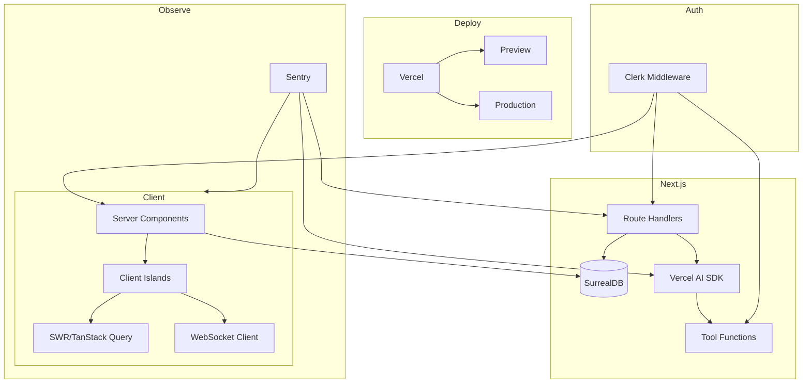

# AI-Enabled Web App Best Practices (2026)

> Research completed: 2026-07-27 | Phase: #1A | Sources: 160+

## Executive Summary

A server-first, tenant-aware architecture using Next.js App Router + React Server Components + Vercel AI SDK + Clerk + TanStack Query/SWR + SurrealDB + Vercel Deploy + Sentry + Playwright.

---

## 1. Next.js App Router & React Server Components

**Architecture**: Server Components by default for data access, secrets, reduced JS. Client Components only for state, effects, event handlers, browser APIs.

```text
app/
├── (app)/
│   └── orgs/[slug]/
│       ├── layout.tsx          # Server Component: auth + tenant resolution
│       ├── page.tsx            # Server Component: initial queries
│       ├── loading.tsx
│       ├── error.tsx
│       └── chats/[chatId]/
│           └── page.tsx
├── api/
│   └── chat/route.ts           # streaming Route Handler
```

**Rules**:
- Concurrent `Promise.all` for independent RSC reads to avoid waterfalls
- `loading.tsx` for route-level streaming, `<Suspense>` for partial areas
- Explicit caching: `revalidateTag()`, `updateTag()`, `revalidatePath()`
- `import "server-only"` on server-only modules
- Server Actions as untrusted entry points: auth, authorize, validate, rate-limit

---

## 2. Vercel AI SDK — Streaming, Tools, Multi-Turn

**Message persistence**: `UIMessage[]` is the durable format. Validate with `validateUIMessages()`, convert with `convertToModelMessages()`.

**Architecture**:
```
POST /api/chat
  ├── auth() → userId, orgId
  ├── loadChat() de la DB autoritativa (no confiar en el historial del navegador)
  ├── validateUIMessages(messages, tools)
  ├── streamText() con system prompt, tools, stopWhen(isStepCount(5))
  └── onFinish → saveChatMessages()
```

**Tool safety**:
- Re-authorize in every tool: `auth()` inside `execute()`, never trust model args
- `needsApproval` for destructive, expensive, externally visible operations
- Bound loops: `stopWhen(isStepCount(5))`
- Pass `AbortSignal` for client cancellation
- Idempotency keys for mutating tools
- Cap message count, byte size, attachment type, token budget

---

## 3. Clerk Authentication & Org RBAC

**July 2026**: `createRouteMatcher()` is deprecated. Protect resources as close to the resource as possible.

**Middleware**:
```ts
clerkMiddleware({
  authorizedParties: [...],
  organizationSyncOptions: { organizationPatterns: ['/orgs/:slug/(.*)'] }
})
```

**Resource-level checks** (every page, route handler, server action, tool):
```ts
const { userId, orgId, has } = await auth();
if (!userId || !orgId) notFound();
if (!has({ permission: 'org:projects:read' })) notFound();
```

**RBAC**: Custom permissions: `org:projects:read`, `org:projects:manage`, `org:projects:delete`, `org:ai:use`. Prefer `has({ permission })` over role checks. `orgId` on every tenant-owned record.

---

## 4. Real-Time State Sync

**Choose one** cache per bounded context:
- **SWR**: lightweight, Vercel-native, `useSWRSubscription` for WebSocket/SSE
- **TanStack Query**: complex mutations, optimistic updates, infinite queries

**WebSocket protocol**:
```json
{
  "id", "orgId", "entity", "entityId", "version", "type", "payload"
}
```
- Authenticate WS handshake, authorize subscriptions server-side
- Deduplicate events by ID, ignore older versions
- Reconnect with exponential backoff + jitter, refetch after reconnect
- Invalidate queries on sequence gaps
- Use managed WebSocket/realtime service or SurrealDB live queries

---

## 5. Vercel Deployment Pipeline

```yaml
CI gates: lint → typecheck → unit-test → integration-test → build → deploy-preview
  → playwright-preview → accessibility → preview-smoke

Production: approve-commit → verify-prod-env → vercel-promote → production-smoke
```

**Critical**: `vercel promote` triggers a **new production build using Production env vars**. Preview values do not carry over.

**Env**: Same variable names across environments with independent values. Isolated Preview databases, Clerk instances, API keys per env.

---

## 6. Sentry Error Observability

**Setup**: `npx @sentry/wizard@latest -i nextjs` → `withSentryConfig` wrapping `next.config.ts`

**Required files**: `instrumentation.ts`, `sentry.server.config.ts`, `sentry.edge.config.ts`, `app/global-error.tsx`

**Tags**: `environment`, `release` (commit SHA), `runtime`, `ai_provider`, `ai_model`

**Alerts**:
- Issue alerts: new production issue >5 users, regression, auth failures above threshold
- Metric alerts: error rate, p95 latency above SLO, AI provider failure rate, tool failure rate

**Never attach**: full prompts, model outputs, auth headers, cookies, tool secrets, PII

---

## 7. Figma Design-to-Code

**Token hierarchy**:
```
Primitive → Semantic → Component
color.blue.600 → color.surface.brand → button.primary.bg
```

**Pipeline**:
```
Figma Variables → tokens/source/*.json → Style Dictionary → tokens.css → Tailwind theme
```

**CI**: Export tokens → run Style Dictionary → fail if generated != committed → visual regression in light/dark/high-contrast. Token PRs require design+eng approval. Lint against raw hex values.

---

## 8. SurrealDB Schema & Graph Relations

**SCHEMAFULL for business data**:
```sql
DEFINE TABLE project SCHEMAFULL;
DEFINE FIELD org ON project TYPE record<organization>;
DEFINE FIELD name ON project TYPE string ASSERT !!$value;
```

**Graph relations**: Use `TYPE RELATION FROM … TO …` when edge has attributes (role, timestamp, weight) or is queried in both directions. Unique `(in, out)` indexes.

**Live queries** (tenant-scoped):
```sql
LIVE SELECT id, name, status, updated_at FROM project WHERE org = $org;
KILL $live_handle; -- on disconnect/logout/unmount
```

---

## 9. Playwright E2E Strategy

**Layers**: Unit → Contract → E2E (mocked AI) → Evaluation (real AI, scheduled)

**AI mocking**:
```ts
import { MockLanguageModelV4, simulateReadableStream } from 'ai/test';
```

**Mandatory scenarios**: streaming first token, cancellation, tool success/failure, approval/rejection, unauthorized access, concurrent tabs, WebSocket disconnect/reconnect, partial response, multi-turn with history, keyboard/focus/acc

**Cross-tenant guarantees**: verify no data leakage in pages, APIs, tools, subscriptions

---

## Reference Architecture Diagram


