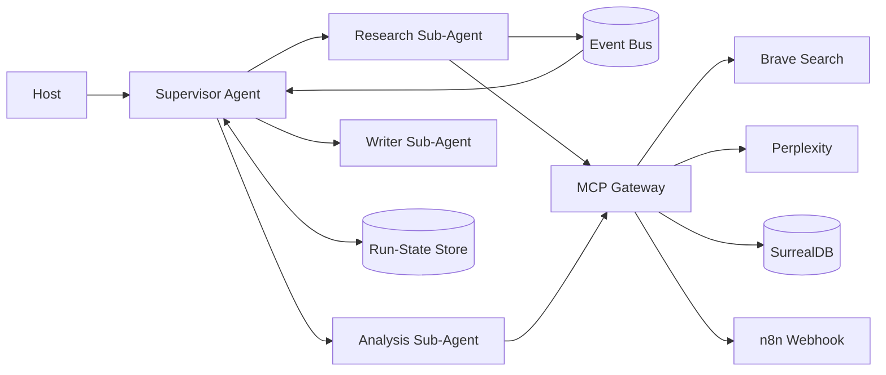

# MCP Server & Agent Skills Best Practices (2026)

> Research completed: 2026-07-27 | Phase: #1B | Sources: 92+

## Executive Summary

Target MCP protocol version `2025-11-25`. Use **Streamable HTTP** for remote servers, **stdio** for local subprocess. Agent skills use `SKILL.md` with YAML frontmatter and progressive disclosure. Orchestrate agents via supervisor-worker pattern with typed handoffs, event bus, and shared memory tiers.

---

## 1. MCP Protocol Specification

**Protocol version**: `2025-11-25` (released). Negotiated independently of server/package version.

**Lifecycle**: `initialize` → `notifications/initialized` → `tools/list` → `tools/call`

**Transports**:

| Transport | Use | Key Rules |
|-----------|-----|-----------|
| **stdio** | Local desktop/CLI, one client per server process | One JSON-RPC per line; no embedded newlines; stdout for MCP only; stderr for logs |
| **Streamable HTTP** | Remote, shared, independently deployed servers | Single `/mcp` endpoint; POST returns JSON or SSE; optional GET for server→client SSE; optional sessions with `MCP-Session-Id`; resumable via `Last-Event-ID` |
| **Legacy HTTP+SSE** | Compatibility only | Separate SSE and POST endpoints; do not use for new deployments |

**Streamable HTTP is NOT the "SSE transport"**. SSE is an optional streaming mechanism inside Streamable HTTP.

---

## 2. Tool Definitions & JSON Schema

**Schema**: JSON Schema 2020-12 (default when `$schema` omitted).

**Required fields per tool**: `name`, `description`, `inputSchema`. Optional: `outputSchema`, `annotations`, `execution` (task support).

**Best practices**:
- `additionalProperties: false` on all objects
- Enums over free-form strings
- Bounds on strings, arrays, numbers
- Separate read and write tools (`document.get` vs `document.update`)
- No generic `execute`, `request_url`, or `run_sql` tools
- `outputSchema` with `structuredContent` for machine consumers
- Text compatibility block for older clients
- Annotations as hints (not authorization): `readOnlyHint`, `destructiveHint`, `idempotentHint`

**Example tool contract**:
```json
{
  "name": "research.run",
  "description": "Research a bounded question and return a persisted, cited report.",
  "inputSchema": {
    "type": "object",
    "additionalProperties": false,
    "properties": {
      "query": { "type": "string", "minLength": 3, "maxLength": 2000 },
      "maxSources": { "type": "integer", "minimum": 1, "maximum": 20, "default": 8 },
      "idempotencyKey": { "type": "string", "minLength": 16, "maxLength": 128 }
    },
    "required": ["query", "idempotencyKey"]
  },
  "outputSchema": {
    "type": "object",
    "additionalProperties": false,
    "properties": {
      "operationId": { "type": "string" },
      "status": { "type": "string", "enum": ["completed", "accepted"] },
      "reportId": { "type": "string" },
      "sourceCount": { "type": "integer", "minimum": 0 }
    },
    "required": ["operationId", "status", "sourceCount"]
  },
  "annotations": {
    "readOnlyHint": false,
    "destructiveHint": false,
    "idempotentHint": true,
    "openWorldHint": true
  }
}
```

**Error handling**: JSON-RPC protocol errors for malformed requests. `isError: true` for tool-level input/API/business failures so the model can self-correct.

---

## 3. Agent Skill Authoring

**Format**: Directory with `SKILL.md` (YAML frontmatter + Markdown body).

```text
cited-research/
├── SKILL.md
├── scripts/
│   └── validate-report.ts
├── references/
│   ├── source-policy.md
│   └── report-schema.json
└── assets/
    └── report-template.md
```

**Frontmatter**: `name` (required, lowercase alphanumeric + hyphens, matches folder), `description` (required), optional: `compatibility`, `license`, `metadata` (version, author), `allowed-tools`

**Progressive disclosure**:
1. At discovery: load only `name` and `description`
2. When selected: load full `SKILL.md`
3. When executing: load scripts and references
4. Keep `SKILL.md` under ~500 lines / 5,000 tokens

**Operational instructions**: Write steps, decision points, constraints, and recovery. Document pitfalls, not generic model knowledge. Define structured input/output with JSON examples.

---

## 4. Idempotency & Retries

**Idempotency model**:
```json
{ "operationId": "...", "idempotencyKey": "tenant:tool:sha256-request", "attempt": 1 }
```

**Idempotency ledger**: Track `(tenant, tool, idempotencyKey)` → state (pending/completed/failed) with result reference. Same key + same request = return prior result. Same key + different request = conflict error.

**Retry policy**:
- Retry: network resets, 408, 429, selected 5xx
- Do NOT retry: 4xx, schema errors, permission denials
- Honor `Retry-After` header
- Exponential backoff with full jitter, bounded by deadline
- Circuit breaker for persistently unhealthy providers
- Only retry writes with idempotency key

---

## 5. Multi-Agent Orchestration

**Supervisor-worker pattern**:
```ts
type AgentHandoff = {
  taskId: string;
  objective: string;
  contextRefs: Array<{ kind, id }>;
  constraints: {
    maxToolCalls: number;
    deadline: string;
    allowedTools: string[];
    approvalRequiredFor: string[];
  };
  expectedOutputSchema: object;
};
```

**Supervisor responsibilities**: classify, decompose, select worker, pass constrained context, validate output, retry/reroute/approve/terminate, write authoritative state transition.

**Worker responsibilities**: perform one bounded task, return typed results. Do NOT mutate global routing.

**Event bus envelope**:
```json
{
  "eventId", "eventType", "tenantId", "correlationId",
  "causationId", "dedupeKey", "subject", "data", "trace"
}
```
- Assume at-least-once delivery
- Inbox table for deduplication
- Transactional outbox for publishing committed state
- Partition by task/subject for ordering
- Poison messages → dead-letter queue

**Shared memory tiers**:

| Memory | Content | Implementation |
|--------|---------|---------------|
| Run state | Steps, budgets, approvals | Transactional DB |
| Artifact memory | Reports, files, raw responses | Object store |
| Semantic memory | Approved reusable facts | Vector index (tenant-filtered) |
| Episodic audit | Tool calls, state transitions | Append-only event store |

---

## 6. Tool Chaining: Brave → Perplexity → SurrealDB → n8n

**Pipeline**:
```
Brave Search → normalize/deduplicate sources → Perplexity deep research
→ validate report schema → SurrealDB upsert → outbox event
→ n8n webhook consume → notify → record delivery
```

**Orchestrator pattern**:
1. Idempotency check/acquire
2. Brave search for bounded source set
3. Deduplicate, rank, filter by source policy
4. Perplexity deep research with selected sources
5. Poll with deadline
6. Validate output against schema
7. Transactional SurrealDB upsert + outbox write
8. Outbox dispatcher → n8n webhook
9. Persistence BEFORE notification
10. Deterministic record IDs for idempotent retries

**Do NOT**: let webpage content select tools, pass MCP bearer tokens to providers, notify before persistence.

---

## 7. API Keys, OAuth & Scoped Permissions

**MCP auth model**: MCP server = OAuth 2.1 resource server, MCP client = OAuth client. PKCE required. Server validates token was issued for it.

**Anti-pattern**: Token passthrough — never pass MCP client's bearer token to upstream providers. Each boundary gets its own credential.

**Scope map**: `research.search`, `research.run`, `report.read`, `report.write`, `notification.preview`, `notification.send`, `credentials.rotate` (not model-callable)

**Key rotation**: Dual-key overlap: create K2 → store as `next` → deploy consumers → switch → monitor → revoke K1 → remove after audit window.

---

## 8. Semantic Versioning

**Three version domains**:

| Domain | Format | Example |
|--------|--------|---------|
| MCP protocol | `YYYY-MM-DD` | `2025-11-25` |
| Server/package | SemVer | `3.2.1` |
| Skill | SemVer in `metadata.version` | `2.1.0` |

**Skill/tool SemVer policy**:
- **PATCH**: wording, retries, diagnostics (same contract)
- **MINOR**: optional fields, new tools, backward-compatible procedures
- **MAJOR**: removed/renamed fields, changed types, new required inputs

**Compatibility rules**: keep tool names stable, never silently repurpose, add optional fields with defaults, introduce `tool.v2` for semantic changes, deprecate before removing.

---

## 9. Testing MCP Servers

**Test pyramid**:

| Layer | What to Test |
|-------|-------------|
| Unit | Domain handlers, normalization, auth, retries, idempotency |
| Schema/contract | `tools/list`, input/output schemas, structuredContent validation |
| In-memory protocol | Initialize, discover, call via linked client/server transports |
| stdio integration | Child process startup, framing, stdout cleanliness, shutdown |
| HTTP integration | POST/GET/SSE, session IDs, version headers, origin checks, resumption |
| E2E | Host/agent → MCP → provider → persistence → n8n |
| Skill evaluation | Activation precision/recall, workflow adherence, output quality |

**In-memory transport** (TypeScript SDK):
```ts
const [clientTransport, serverTransport] = InMemoryTransport.createLinkedPair();
```

**Contract cases**: discovery, schema validation, structured output, idempotency replay, key conflict rejection, 429/Retry-After, 403 non-retry, cross-tenant isolation, credential redaction.

---

## 10. n8n Handoffs

**Webhook envelope**:
```json
{
  "schemaVersion": "1.0",
  "eventId": "...",
  "eventType": "research.report.completed",
  "correlationId": "...",
  "idempotencyKey": "notify:report-123:slack",
  "tenantId": "tenant-42",
  "payload": { "reportId": "...", "title": "...", "artifactUrl": "..." }
}
```

**Security**: HMAC-SHA256 signature with timestamp + raw body. Reject timestamps outside 5-minute window. Deduplicate `eventId` before actions.

**Workflow pattern**: Webhook → verify auth → reject replay → validate payload → upsert dedup record → switch by eventType → execute sub-workflow → optional human approval → notify → record delivery → respond 202.

---

## Reference Architecture


